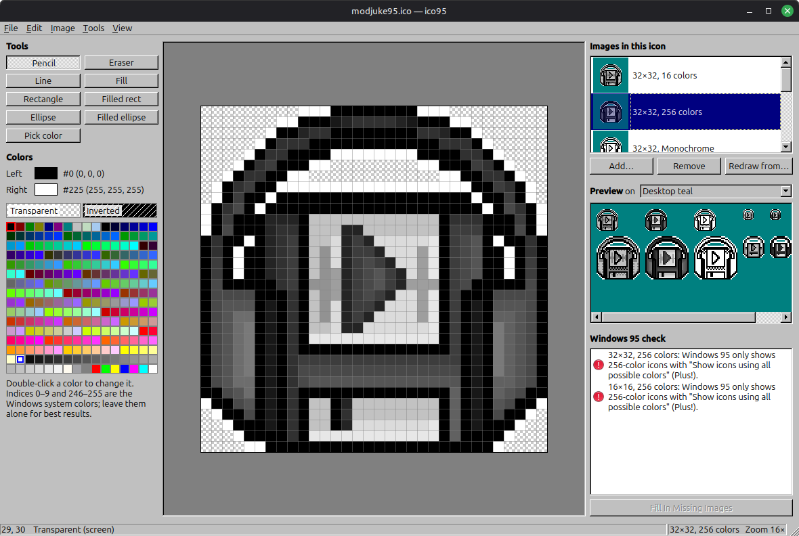

# ico95



A pixel editor for `.ico` files meant for Windows 95 programs.

```
python3 ico95.py [file.ico]
```

Needs Python 3 and PyQt6.

## What it makes

One `.ico` file holds several images; Windows picks the best fit.

| Image | Used by |
|---|---|
| 32×32, 16 colors | Windows 95 main icon (desktop, Explorer, Alt+Tab) |
| 16×16, 16 colors | title bars, taskbar, Start menu, small icons |
| 256 colors | Windows 95 only with Plus! "Show icons using all possible colors" |
| 48×48 | Windows 98 / 2000 / XP large icons; ignored by Windows 95 |
| Monochrome | monochrome displays |

* 16-color and monochrome images use the fixed standard Windows palette. 256-color
  images start from the Windows system palette (20 static colors, a 6×6×6 cube and
  grays). You can change any entry by double-clicking it.
* Each pixel can also be **Transparent** (AND mask set, XOR black) or **Inverted**
  (AND mask set, XOR white), the same two "screen colors" the classic Microsoft
  Image Editor had.
* ico95 writes uncompressed `BITMAPINFOHEADER` DIBs with XOR and AND masks. The
  32×32 16-color image comes first, because old tools only read the first entry.

The **Windows 95 check** panel validates the icon as you draw. Errors such as
duplicate formats or transparency without black in the palette block saving.
Warnings flag empty images and anything that is valid but works poorly on
Windows 95.

Open loads the classic 1/4/8-bit images of an `.ico` file. For a newer
(24/32-bit or PNG) icon, use File → Import Picture.

## Workflows

### Minimal

1. **File → New.** The icon starts with blank 32×32 and 16×16 images, both
   16 colors.
2. **Draw the 32×32 image.** Leave the background Transparent.
3. **Click Fill In Missing Images.** It redraws the blank 16×16 from your 32×32.
   Touch it up if it looks rough.
4. **Save.**

The 16×16 is optional. If you remove it, the icon is still valid, but Windows 95
shrinks the 32×32 itself for small icons, which looks worse. The check panel
warns about this without blocking the save.

### Complete

1. **File → New**, then draw the **32×32, 16 colors** image. Windows 95 shows this
   one almost everywhere, so put the most care into it.
2. **256 colors (optional):** Add… → 32×32, 256 colors, starting from a scaled copy
   of the 16-color image, then add shading. Windows 95 only shows it with the
   Plus! "Show icons using all possible colors" setting; Windows 98 and later use
   it routinely.
   You can also start in 256 colors, then use Fill In Missing Images to create
   the 16-color versions and touch them up. Turn on Image → Dither When Reducing
   Colors first if the artwork is shaded.
3. **16×16:** Fill In Missing Images (or Redraw from… the 32×32), then fix it by
   hand. Shrinking keeps every other pixel, so outlines break up. Classic icon
   artists usually redrew this size in simplified form instead of scaling it.
   If you made a 256-color 32×32, also use Add… → 16×16, 256 colors, starting
   from a scaled copy of it. Fill In only creates 16-color images.
4. **48×48 (optional, Windows 98/2000/XP):** Add… → 48×48 in 16 and/or 256
   colors, starting from the 32×32 or drawn fresh. Windows 95 ignores it.
5. **Check:** view the preview on teal, gray, white and black. Clear every red
   error in the Windows 95 check panel. Once the 16-color versions exist, the
   48×48 and 256-color warnings are just notes.
6. **Save.**
7. **Put it in your program.** In the resource script:

   ```rc
   1 ICON "app.ico"
   ```

   Explorer uses the first icon resource in the program as its icon. For window
   title bars, set `hIcon = LoadIcon(hInstance, MAKEINTRESOURCE(1))`. With
   `RegisterClassEx`, also set `hIconSm` from
   `LoadImage(hInstance, MAKEINTRESOURCE(1), IMAGE_ICON, 16, 16, 0)`, so Windows
   uses your hand-drawn 16×16.

## Usage

* Left and right mouse buttons paint with the left and right colors. Pick each
  one by clicking a palette swatch with that button.
* Tools: pencil, eraser (paints transparent), line, rectangle, ellipse (filled or
  outline; hold Shift for squares and circles), flood fill and color picker.
* **Fill In Missing Images** (button under the check panel, or the Image menu)
  creates every 16-color image Windows 95 wants that the icon lacks: 32×32, 16×16,
  and a 16-color partner for each 256-color size. A fully transparent image counts
  as missing and is replaced. Each new image is converted from the best drawn
  one: the same size if possible, then a larger image (shrinking beats enlarging),
  then the same color depth. It's one undo step. Saving never converts anything.
* **Redraw from…** replaces the current image with a scaled copy of another one.
  **Add…** can start a new image the same way.
* **File → Import Picture** scales a PNG/BMP/… into the current image.
* **Image → Dither When Reducing Colors** (off by default) switches all of these
  conversions from nearest color to Floyd–Steinberg dithering. Dithering suits
  shading and gradients. Leave it off for flat pixel art.
* Scaling is nearest neighbor, so converted images, especially 16×16 ones,
  usually need touching up by hand.
* Ctrl+wheel (or Ctrl+plus / Ctrl+minus) zooms. Drop an `.ico` file on the window to open it.

## Files

* `icoformat.py`: ICO reading, writing, palettes and validation (no GUI)
* `raster.py`: line, rectangle, ellipse, flood fill and flips
* `ico95.py`: the Qt GUI